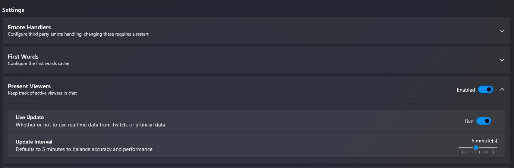

# TwitchHeists

> A Streamer.bot add-on for Twitch chat points, watchtime, heists, raffles, and a leaderboard.

TwitchHeists gives your channel a simple points system with a few built-in chat games.

- viewers earn points and watchtime while they are active
- chat can check balances and leaderboards
- viewers can join heists with their own points
- mods or the broadcaster can run raffles
- everything is saved locally in SQLite

## 🚀 Quick start

1. Download the release files from GitHub.
2. Put them in your Streamer.bot extensions folder:

```text
D:\Streamer Bot\Extensions\TwitchHeist\
  TwitchHeists.txt
  TwitchHeists.StreamerBot.Bridge.dll
  TwitchHeists.StreamerBot.dll
  TwitchHeists.Core.dll
  TwitchHeists.Data.Sqlite.dll
  appsettings.json
  heist-messages.json
```

3. Import [TwitchHeists.txt](./TwitchHeists.txt) into Streamer.bot.
4. Enable **Platforms > Twitch > Present Viewers > Live Update** in Streamer.bot.



For the full Streamer.bot wiring guide, see [`.github/docs/streamerbot-install-guide.md`](./.github/docs/streamerbot-install-guide.md).

## 💬 Main chat commands

### 💰 Points and leaderboard

| Command | What it does |
|---|---|
| `!points` | Shows your own points balance. |
| `!points <user>` | Shows another viewer's points balance. |
| `!leaderboard` | Shows the top 5 point balances in chat. |
| `!watchtime` | Shows your own lifetime watchtime tracked by TwitchHeists. |
| `!watchtime <user>` | Shows another viewer's tracked lifetime watchtime. |
| `!points give <user> <amount>` | Lets a viewer give some of their own points to someone else. |

### 🛠️ Moderator / broadcaster tools

| Command | What it does |
|---|---|
| `!points add <user> <amount>` | Adds points to one viewer. |
| `!points remove <user> <amount>` | Removes points from one viewer. |
| `!raffle` | Starts a multi-winner raffle using the default raffle prize from settings. |
| `!raffle <points>` | Starts a multi-winner raffle with a custom prize per winner. |
| `!sraffle` | Starts a single-winner raffle using the default raffle prize from settings. |
| `!sraffle <points>` | Starts a single-winner raffle with a custom prize for the winner. |

### 🎯 Heists and raffle join commands

| Command | What it does |
|---|---|
| `!heist <amount>` | Starts a heist with the starting stake amount. |
| `!join <amount>` | Joins the current heist with your own stake. |
| `!rjoin` | Joins the current raffle for free. |

## ⏱️ How points and watchtime work

TwitchHeists rewards viewers on a repeating timer while they are actively present in stream.

With the default settings:

- the reward cycle runs every **5 minutes**
- a normal viewer gets **500 points every cycle**
- TwitchHeists also adds those **5 minutes** to lifetime watchtime

### ⭐ Subscriber bonuses

Subscribers get more points from the same reward cycle.

| Viewer type | Multiplier | Default points every 5 minutes |
|---|---:|---:|
| Non-sub | `x1.0` | `500` |
| Tier 1 sub | `x1.5` | `750` |
| Tier 2 sub | `x2.0` | `1000` |
| Tier 3 sub | `x3.0` | `1500` |

`!watchtime` shows **lifetime rewarded watchtime**, not just the current stream.

## 🎉 How raffles work

There are two raffle modes:

- `!raffle` = multiple winners
- `!sraffle` = one winner only

### ⏳ Raffle timing

With the default settings:

- raffle join window = **2 minutes**
- reminder messages go out at **1 minute**, **30 seconds**, and **10 seconds**

### 🎁 Raffle prize amount

- `!raffle 2000` means every winner gets **2000 points**
- `!sraffle 2000` means the one winner gets **2000 points**
- if you do **not** type an amount, TwitchHeists falls back to `Raffle.WinnerPoints`
- with the default config, that fallback is **5000 points**

### 🙋 Joining a raffle

`!rjoin` is free.

- viewers do **not** spend points to join
- TwitchHeists does **not** block raffle joins based on balance

### 🏆 Multi-winner raffle tiers

`!raffle` increases the winner count as more people join.

| Entrants | Winners |
|---|---|
| 1 | 1 winner |
| 2-10 | about half the field wins |
| 11-20 | about a quarter of the field wins |
| 21-50 | about one fifth of the field wins |
| 51-200 | about one eighth of the field wins |
| 201+ | about 5% of the field wins |

Examples:

- 4 entrants -> 2 winners
- 10 entrants -> 5 winners
- 20 entrants -> 5 winners
- 40 entrants -> 8 winners
- 80 entrants -> 10 winners
- 200 entrants -> 25 winners

`!sraffle` ignores those tiers and always picks **exactly one** winner.

## 💣 How heists work

Heists are a risk-and-reward game where viewers put their own points into the pot.

### 🚪 Starting and joining

- `!heist <amount>` starts the run with any positive stake
- `!join <amount>` joins the open run, but must meet `Heist.MinimumJoinAmount`
- if a viewer does not have enough points, they cannot start or join
- with the default config, `!join` needs at least **1000 points**
- after a heist resolves, the default cooldown before the next start is **5 minutes**

### 🎲 Heist success chance

The heist chance is designed to get easier as more people join, but harder as the total stake gets bigger.

With the default settings:

- the chance starts from a **maximum of 75%**
- every extra participant after the first adds **3 percentage points**
- larger total stakes lower the chance
- the final chance is never allowed to go below the configured **minimum of 40%**
- the final chance is never allowed to go above the configured **maximum of 75%**

In plain English:

- bigger crews help your odds
- bigger pots hurt your odds
- the chance always stays between your configured minimum and maximum

### ✅ What happens on success

With the default settings:

- the final pot is multiplied by **2x**
- one or more winners are picked from the crew
- winners split the final pot
- bigger personal stakes give a bigger share if that viewer wins

### ❌ What happens on failure

- everyone in the crew loses the stake they put in

### 👥 Minimum crew rule

By default, a heist needs at least **2 participants**.

If not enough viewers join before the timer ends:

- the heist is treated as **not enough crew**
- the participants are refunded instead of being forced into a normal fail result

## ⚙️ Default settings at a glance

The shipped defaults are:

### 💎 Rewards

- reward interval: **5 minutes**
- base points per interval: **500**
- Tier 1 multiplier: **1.5x**
- Tier 2 multiplier: **2.0x**
- Tier 3 multiplier: **3.0x**

### 💣 Heist

- join window: **2 minutes**
- cooldown window: **5 minutes**
- minimum success chance: **40%**
- maximum success chance: **75%**
- minimum participants: **2**
- minimum join amount for `!join`: **1000**
- successful pot multiplier: **2x**

### 🎟️ Raffle

- join window: **2 minutes**
- reminder thresholds: **1 minute / 30 seconds / 10 seconds**
- default winner prize: **5000 points**

## 📝 Notes

- `TwitchHeists.txt` is the Streamer.bot import file.
- Your data is stored locally in the TwitchHeist folder.
- If you want to change timings, point values, or raffle defaults, edit `appsettings.json`.
